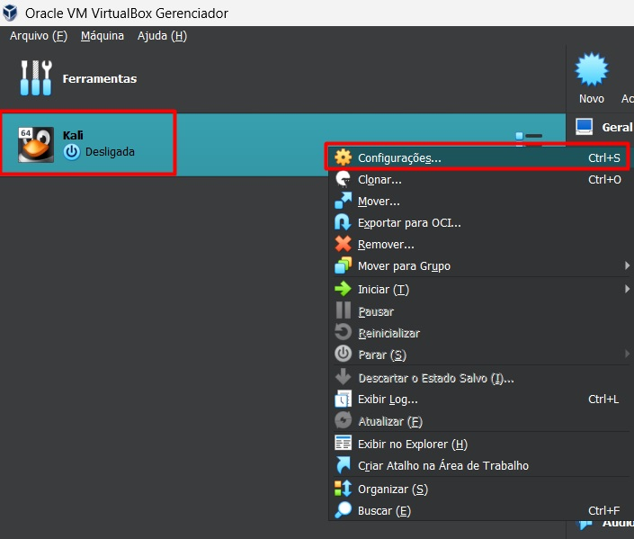
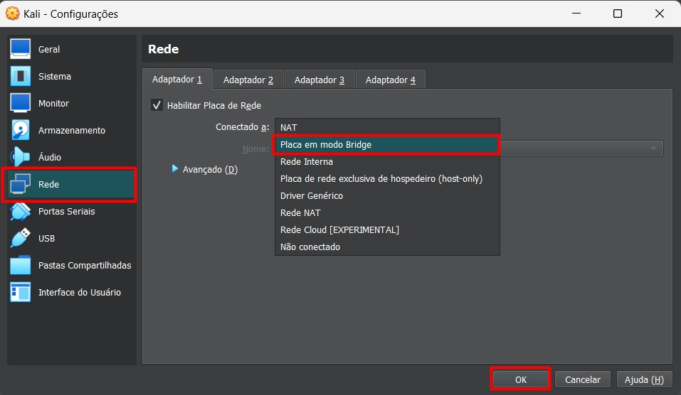
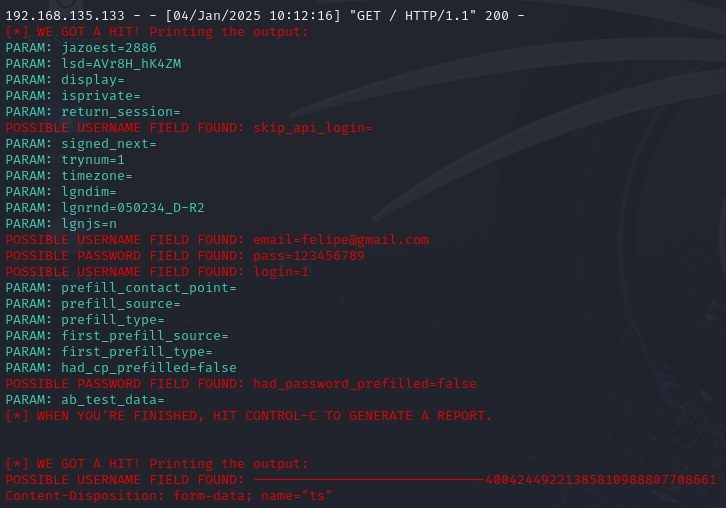

# Phishing para captura de senhas do Facebook

### Ferramentas

- Kali Linux
- setoolkit

### Configurando a Máquina Virtual

- Precisamos ter acesso a internet para isso vamos realizar um ajuste em nossa máquina virtual.
- Click com o direito na Máquina Virtual e depois em Configurações;

- Click em Rede e selecione a opção Placa em modo Bridge, conforme imagem abaixo;


-  Após as alterações ligue a máquina virtual ou reinicie caso já esteja ligada.

### Configurando o Phishing no Kali Linux

- Após iniciar a máquina virtual abra um terminal
- Precisamos de acesso root no terminal execute o comando: ``` sudo su ```
- Executar o setoolkit execute: ``` setoolkit ```
- Selecionar o tipo de ataque: ``` Social-Engineering Attacks ```
- Selecionar o vetor de ataque: ``` Web Site Attack Vectors ```
- Selecionar o método de ataque: ```Credential Harvester Attack Method ```
- Selecionar o método de ataque: ``` Site Cloner ```
- Será solicitado o IP da máquina caso precise para obter o endereço da máquina em outro terminal execute: ``` ifconfig ```
- Será sugerido o seu IP bastar pressionar Enter para seguir com o IP sugerido
- Insira a URL para clone, deve ser utilizado a URL com o protocolo `HTTP`: http://www.facebook.com

### Resutados

